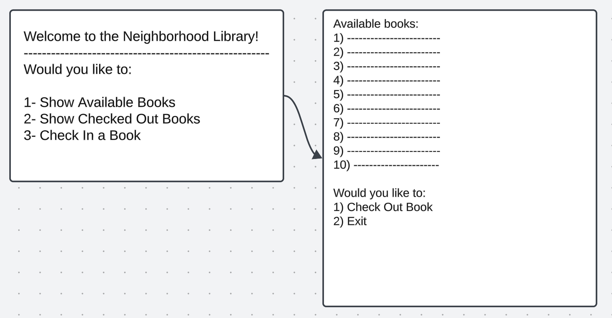
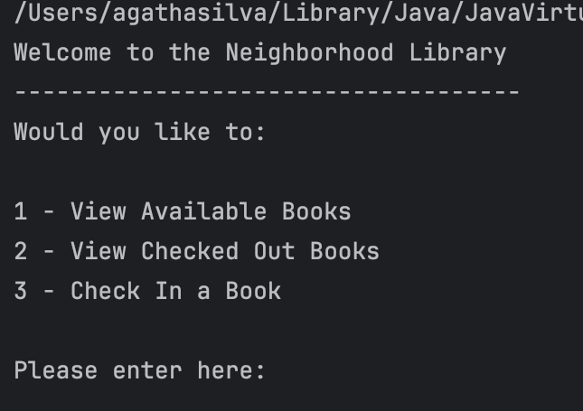
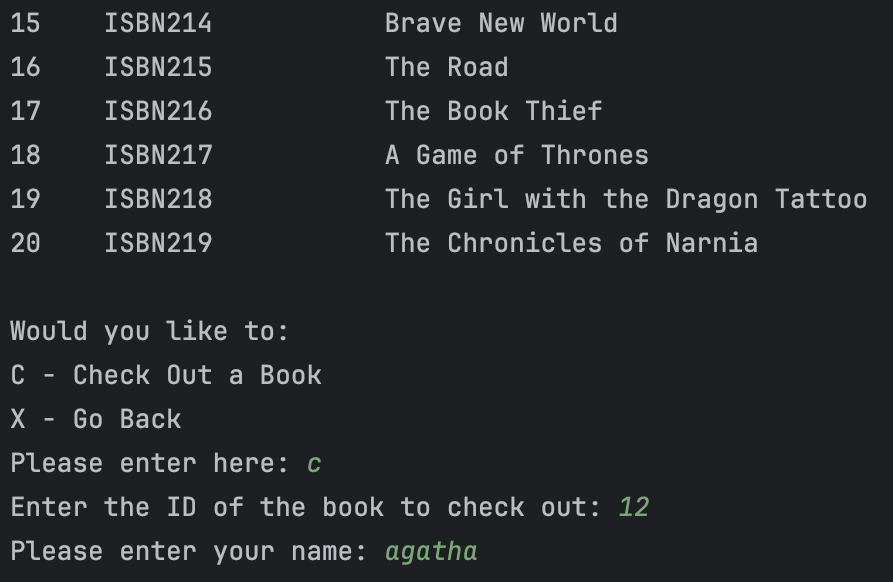

# neighborhod-library
This simple yet effective program is used to manage a local library that is free and easy to use.

### Planning
I started by sketching the layout based on the instructions provided before coding. I later transferrd my sketches onto my computer.

### Code
I decided to limit my project to one class which I titled as "Books", as I am still getting used to utilizing different classes. As a result, my code looks fairly simple while being effective.

(Home Screen View)

(Check Out Screen)

### Final Thoughts
This workshop was definitely challegeing for me, but I was happy to push through and get it done. Although it's not perfect, I felt intellectually challenged and motivated to keep improving.

